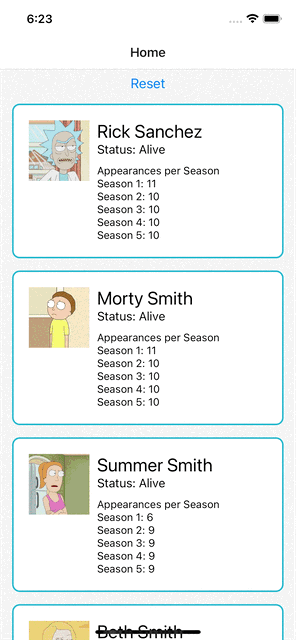

### Description

A Rick and Morty character wiki app written in React Native with the following features:

- Fully-dynamic, paginating FlatList home screen powered by the https://rickandmortyapi.com
- A breakdown of how many appearances each character made per season
- React-Navigation to view a Details screen for each character and all their information
- Pull-to-Refresh and a "Reset" button to clear the existing results and fetch fresh data
- Loading spinners on Pull-to-Refresh and while fetching the next page of FlatList results
- Alerts for fetching errors and on "Reset" button press
- Empty state with "Pull to load data" instructions for the user

# Other notes

The Home screen takes advantage of the performance optimizations build into FlatList, including the
auto-rendering of rendered character cards when in view and their removal when off the screen. The
data component state array appends new pages of data as they are fetched from the API, relying on
the numbered pages of the endpoint to ensure duplicates are not displayed.

While it currently uses "Fetch" to retreive data and React state as a local store, a branch called
RTK-Query-wip is work in progress that currently has a working prototype using Redux Toolkit (RTK)
Query to fetch and display the first page of data. Eventually this can fully migration to the Redux
store with full support of the existing set of features.

### Demo

